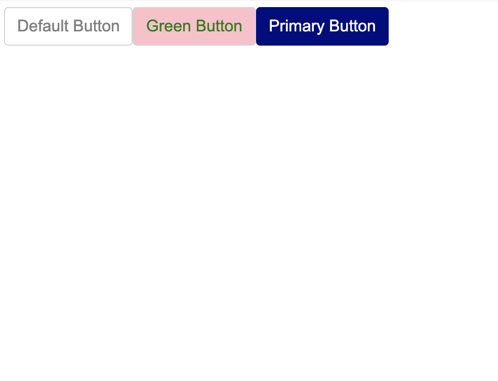

# 가변 스타일링 1

---

Styled Components는 React 컴포넌트에 넘어온 props에 따라 다른 스타일을 적용하는 기능을 제공합니다.

예를 들어, 버튼의 글자색과 배경색을 props에 따라 바뀌도록 위에서 작성한 예제 코드를 변경해보겠습니다. 자바스크립트의 `||` 연산자를 사용하여 props가 넘어오지 않은 경우, 기존에 정의한 기본 색상이 그대로 유지되도록 합니다.

```javascript
import React from "react";
import styled from "styled-components";

const StyledButton = styled.button`
    padding: 0.375rem 0.75rem;
    border-radius: 0.25rem;
    font-size: 1rem;
    line-height: 1.5;
    border: 1px solid lightgray;

    color: ${(props) => props.color || "gray"};
    background: ${(props) => props.background || "white"};
`;

function Button({ children, color, background }) {
  return (
    <StyledButton color={color} background={background}>
      {children}
    </StyledButton>
  );
}
```

여기서 주의할 점은 `<Button />`에 넘어온 `color`와 `background` prop을 `<StyledButton/>` 컴포넌트로 넘겨줘야 한다는 것입니다. (그러지 않을 경우, `<StyledButton/>` 컴포넌트가 해당 prop을 인식할리가 없겠죠?)

자, 이제 다음과 같이 버튼을 사용하면 핑크 배경에 초록 글자를 갖도록 스타일된 버튼을 만들 수 있습니다.

```javascript
import Button from "./Button";
<Button color="green" background="pink">
  Green Button
</Button>;
```

# 가변 스타일링 2

---

prop에 따라 바꾸고 싶은 CSS 속성이 위와 같이 하나가 아니라 여러 개일 경우가 있습니다. 이럴 경우, Styled Components에서 제공하는 `css` 함수를 사용해서 여러 개의 CSS 속성을 묶어서 정의할 수 있습니다.

예를 들어, `primary` prop이 넘어온 경우, 글자색을 흰색, 배경색과 경계색은 남색으로 변경하고 싶다면 다음과 같이 예제 코드를 수정할 수 있습니다. 이번에는 자바스크립트의 `&&` 연산자를 사용해서, `primary` prop이 존재하는 경우에만 `css`로 정의된 스타일이 적용되도록 하였습니다.

```javascript
import React from "react";
import styled, { css } from "styled-components";

const StyledButton = styled.button`
  padding: 0.375rem 0.75rem;
  border-radius: 0.25rem;
  font-size: 1rem;
  line-height: 1.5;
  border: 1px solid lightgray;

  ${(props) =>
    props.primary &&
    css`
      color: white;
      background: navy;
      border-color: navy;
    `}
    
function Button({ children, ...props }) {
  return <StyledButton {...props}>{children}</StyledButton>;
}
`;
```

참고로 넘겨야할 prop 값이 많아질 경우, 위와 같이 `...props` 구문을 사용해서 `children` 외에 모든 prop을 간편하게 전달할 수 있습니다.

자, 이제 다음과 같이 하나의 prop 만으로 여러가지 CSS 속성이 한 번에 적용된 버튼을 얻을 수 있습니다.

```javascript
import Button from "./Button";
<Button primary>Primary Button</Button>;
```

# 전체코드

---

포스트에서 Styled Components로 스타일링한 버튼 컴포넌트에 대한 전체 코드는 아래에 올려 두었으니 참고 바라겠습니다.

<!-- Button.js-->

```javascript
import React from "react";
import styled, { css } from "styled-components";

const StyledButton = styled.button`
  padding: 0.375rem 0.75rem;
  border-radius: 0.25rem;
  font-size: 1rem;
  line-height: 1.5;
  border: 1px solid lightgray;

  color: ${(props) => props.color || "gray"};
  background: ${(props) => props.background || "white"};

  ${(props) =>
    props.primary &&
    css`
      color: white;
      background: navy;
      border-color: navy;
    `}
`;

function Button({ children, ...props }) {
  return <StyledButton {...props}>{children}</StyledButton>;
}

export default Button;
```

<!--Buttons.js-->

```javascript
import React from "react";
import Button from "./Button";

function Buttons() {
  return (
    <>
      <Button>Default Button</Button>
      <Button color="green" background="pink">
        Green Button
      </Button>
      <Button primary>Primary Button</Button>
    </>
  );
}

export default Buttons;
```

### 결과화면


